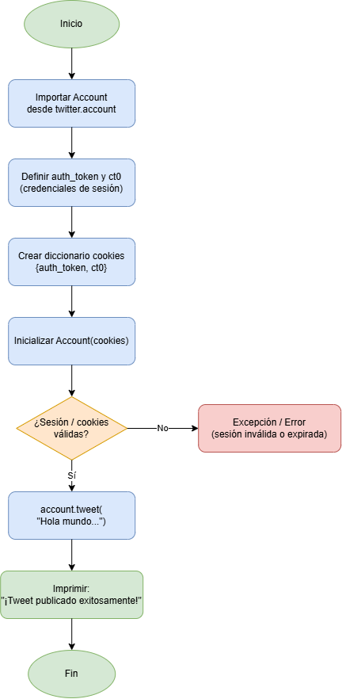

# Twitter-bot

Bot de automatización para X (Twitter) desarrollado en Python con fines académicos.

## Tabla de Contenidos
- [Descripción](#descripción)
- [Diagrama de Flujo](#diagrama-de-flujo)
- [Requisitos](#requisitos)
- [Instalación](#instalación)

---

## Descripción
Este proyecto permite interactuar con la plataforma X (Twitter) mediante scripts de Python utilizando cookies de sesión para omitir los bloqueos tradicionales de credenciales. Permite realizar publicaciones automatizadas y gestionar tareas dentro de la plataforma con fines educativos y de prueba.

---

## Diagrama de Flujo

## *Representación gráfica del flujo del sistema:*

Requisitos
Python 3.10 o superior

Librería twitter-api-client

Una cuenta activa de X (Twitter)

Instalación
Instala la librería requerida ejecutando en tu terminal:
pip install twitter-api-client
Autenticación
Debido a las restricciones actuales de inicio de sesión por usuario y contraseña, este bot utiliza cookies de sesión (auth_token y ct0).

Obtener cookies desde el navegador:
Abre tu navegador e inicia sesión en x.com.

Presiona F12 o da clic derecho y selecciona Inspeccionar.

Ve a Aplicación (o Almacenamiento) > Cookies > [https://x.com](https://x.com).

Copia los valores de las llaves auth_token y ct0.

